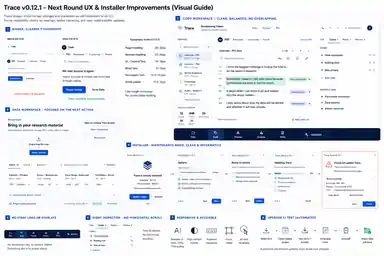

# Trace v0.12.1 Visual Direction

This visual guide supplements the root [`AGENTS.md`](../../AGENTS.md) execution contract for **Trace v0.12.1: UX and Installer Hardening**.

The image is a directional reference, not a pixel-perfect specification. Agents should preserve the existing Trace product architecture and use the written requirements in `AGENTS.md` when the mockup and implementation details differ.

## Non-negotiable ideas shown in the guide

- **Bigger, clearer typography:** ordinary interface and reading text must be comfortably legible during long research sessions. Do not solve overflow by shrinking meaningful text.
- **Clean Code workspace:** the transcript remains the intellectual center of the screen, side panels are usable and resizable, the bottom workspace dock never covers content, and empty states provide obvious next actions.
- **Focused Data workspace:** importing research material is the primary onboarding action. Advanced interoperability and project-management actions remain available without competing with the first task.
- **No stray lines or overlays:** decorative graphics must remain clipped to their components and fixed/floating controls must have reserved layout space.
- **Right inspector without horizontal scrolling:** `Info`, `Codes`, `Notes`, and `Memos` fit cleanly at the normal inspector width; long content scrolls vertically or wraps intentionally.
- **Installer maintenance mode:** existing installations show installed and new versions, project-data protection is explicit, update/repair terminology is consistent, and failures state the actual problem plus a useful next action.
- **Actionable diagnostics:** installer errors may expose technical details and logs, but must never leak research content.
- **Responsive and accessible behavior:** common Windows resolutions, 100–175% scaling, keyboard navigation, focus visibility, readable contrast, and sensible pointer targets are part of the acceptance criteria.
- **Upgrade CI:** a previous verified version must be installed first, representative research data created, the new exact branded installer run as an update, data verified intact, and uninstall verified not to remove projects.

## Implementation rule

Use this visual guide to understand the intended hierarchy, proportions, readability and workflow. Use [`AGENTS.md`](../../AGENTS.md) for the complete phase order, P0/P1/P2 priorities, acceptance gates, test matrix, release rules and handoff requirements.
